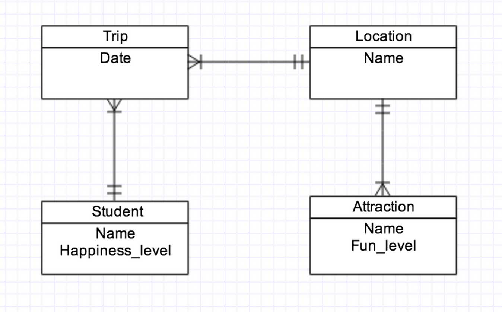

## Blue Book W04 Answers

Below are some exemplary student answers to the questions from last week's blue book quiz.

#### Question 1: Explain what an ORM is and why we would use one.

Student Answer: "An object relational mapper provides us with a means to map a model to a database table.  An ORM such as ActiveRecord also "writes" SQL for us as we interact with our database using Ruby-esque syntax.   Using an ORM we can efficiently and rather effortlessly persist data associated with our model(s), as well as easily and concisely write complex queries."

#### Question 2: Explain the use and usefulness of ActiveRecord validations and how they affect persistence.

Student Answer: "ActiveRecord validations verify that a model's attributes meet certain specified criteria before saving that object to the database. Validations affect persistence because if the validation criteria is not met, the input is rejected and the data is not persisted."

#### Question 3: Describe the parts of a url in detail

Student Answer: 
- Example URL: `http://google.com/images/all`

    - `http://` specifies the protocol (http://, https://, ftp:// are other examples)

    - `google.com` is the domain

    - `/images/all` is the path

#### Question 4: Explain the idea of "separation of concerns" and how it relates to the roles of HTML, CSS and JavaScript.

Student Answer: "Separation of concerns relates to the idea of encapsulation, meaning each piece of a program should perform a distinct and authoritative function, as dictated by the code therein, and should not repeat or interfere with another component's role. This helps avoid proverbial "spaghetti code". HTML should provide structured content.  CSS should provide styling. JavaScript should make the content dynamic and interactive." 

#### Question 5: List the ActiveRecord relationships implied in this ERD, by class.



Student Anwer: 

```ruby
class Student < ActiveRecord::Base
  has_many :trips
  has_many :locations, through: :trips
end

class Trip < ActiveRecord::Base
  belongs_to :student
  belongs_to :location
end

class Location < ActiveRecord::Base
  has_many :trips
  has_many :students, through: :trips
  has_many :attractions
end

class Attraction < ActiveRecord::Base
  belongs_to :location
end
```

