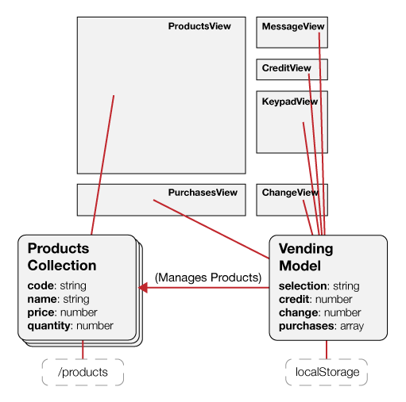

# Vending Machine

This lab focuses on building a transactional model and wiring up to an interface. There's no fancy routing or view switching here. Your emphasis should be on keeping all business logic within the model, and all presentation controls within the view.

## Setup

The API is built and ready to go! Run: 

```
rake db:create
rake db:migrate
rake db:seed
```

Visit the "/products" route… you should have a JSON API ready to go with a list of product models.

## The Application Design

This application consists of several view components all tethered to a common transactional model. The view components should just submit input into the model, and then render out changes as they occur.



## The Models

We've [done this before](https://github.com/ga-students/WDI_DC_1/tree/master/w02/d03/INSTRUCTOR/vending_machine_final/lib), remember? Here's our original Ruby code with some name refactoring… this transactional logic will work verbatim; we just need to traslate the Ruby code into Backbone components:

```
// Product Model

class Product
  attr_reader :code, :name, :price, :quantity
  
  def initialize(code, name='', price=0, quantity=0)
    @code = code
    @name = name
    @price = price
    @quantity = quantity
  end

  def purchase
    @quantity -= 1
  end
end


// Vending Model

class VendingMachine
  attr_reader :status, :selection, :credit, :change, :purchases
  
  def initialize(products=[])
    @status = ''
    @selection = ''
    @credit = 0
    @change = 0
    @purchases = []
    @products = products
  end

  def get_product(code)
    return @products.find do |product|
      product.code == code
    end
  end

  def add_credit(credit)
    @credit += credit
    vend()
  end
  
  def add_selection_digit(digit)
    @selection += digit

    if @selection.length >= 2
      vend()
    end
  end

  def vend
    product = get_product(@selection)

    if !product
      @selection = ""
      @status = "Please enter a valid selection"
    elsif product.quantity <= 0
      @selection = ""
      @status = "Item is out of stock"
    elsif product.price > @credit
      diff = sprintf("%0.2f", product.price - @credit)
      @status = "Please insert an additional $#{diff}"
    else
      product.purchase()
      @purchases.push(product.name)
      @credit -= product.price
      refund()
    end
  end

  def refund
    @change += @credit
    @credit = 0
    @selection = ''
    @status = ''
  end
end
```

If you get stuck or just want to focus on hooking up the view, you can find the completed models into the "__cheat__" folder. You'll need to put them into "javascripts/vending/models".

## The Views
	
* **MessageView** binds to Vending model; displays changes to "credit" and "selection" fields. 

* **CreditView** adds value onto the Vending model's "credit" field.

* **KeypadView** adds digits onto the Vending model's "selection" field.

* **ChangeView** binds to Vending model; displays changes to the "change" model field. Clicking the view resets "change" to zero.

* **PurchasesView** binds to Vending model; displays changes to "purchase" items. Clicking the view resets "purchases" to an empty array.

* **ProductsView** binds to Products collection; displays changes to individual product items.

## Hints

* Manage prices as cents (ie: 150 cents rather than $1.50). Storing integers is simpler than decimals. A currency helper module is included for formatting cents into dollar strings, and parsing cents from dollar strings.

* Add an `id:1` attribute onto the Vending model so that LocalStorage can store and fetch the model based on ID.

* Use ["change:attribute" events](http://backbonejs.org/#Events-catalog) when monitoring changes to specific model attributes.

* Use `array.concat()` when adding items to the purchases array; this will modify the *entire array instance* so that Backbone will trigger change events.