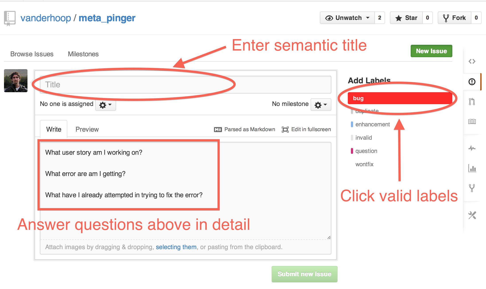
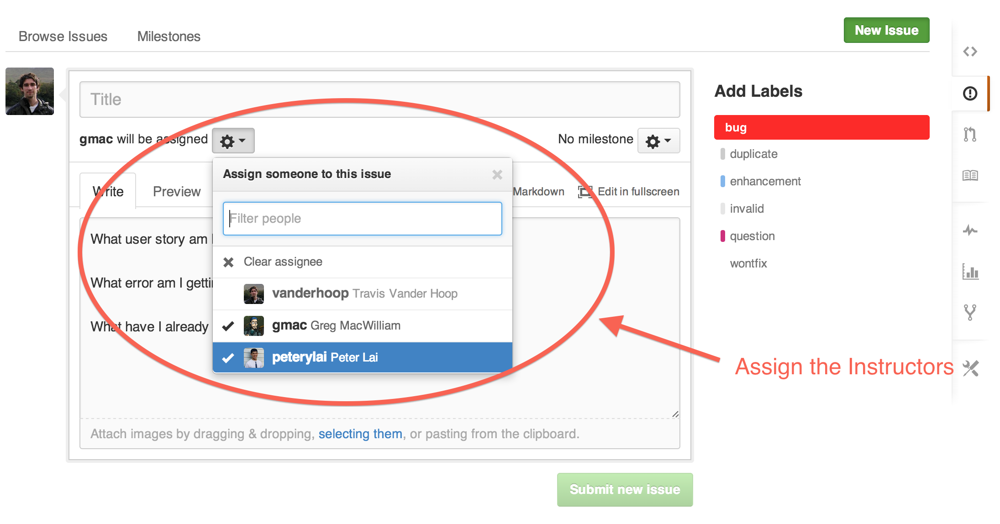
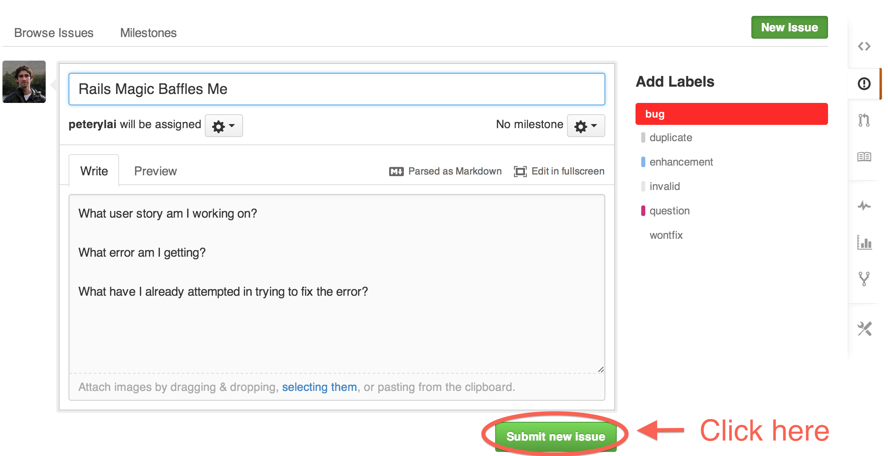

## GitHub Issues Submission

You will be submitting any requests for project help via GitHub issues. In doing so, it is mandatory that you answer these three questions:

1. What User Story are you working on?
1. What error are you getting?
1. What have you attempted to fix your error?

___
###Step 1 - Click 'Issues' Within Your Project Repo

___
###Step 2 - Click 'Create a new issue'

___

###Step 3 - Tell us what you're working on, what error you're getting, and what you've done in your attempt to solve it.

___

###Step 4 - Assign the Instructors to the Issue

___

###Step 5 - Submit the Issue

