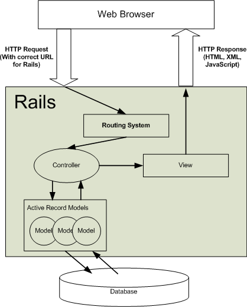

# Routing and views 

Draw on the board:



In this lesson, we are going to talk about "routing":

- When a user makes a request to the browser
- The web-application needs to know what content to show them...

##Let's compare with a file that we have already seen

- Let's look at the recipes_controller.rb file from the cookbook homework.
- In Sinatra we defined the routes within our controller action:

		get '/recipes' do
  		  @recipes = Recipe.all
      	  erb :'recipes/index'
		end 

		get '/recipes/new' do
  		  @recipe = Recipe.new
  		  @categories = Category.all
  		  erb :'recipes/new'
		end
	
##HTTP Verbs
HTTP defines methods (sometimes referred to as verbs) to indicate the desired action to be performed on the identified resource. 

- **GET:** Requests using GET should only retrieve data and should have no other effect.
- **POST:** Requests that the server accept the entity enclosed in the request as a new subordinate of the web resource identified by the URI.


- Routing is how web-browser requests get directed to actions in controllers
- **Combination of HTTP verb (POST, GET, PUT, DELETE) and the params in the  path (/www.website.co.uk/person/3)**


##Make a new rails app

	rails _3.2.19_ new routing_app

- Rails has a "routing engine" that separates this from the controller.
- Refer to the diagram...
- Rails generates it for you: `Rails.root/config/routes.rb`

## But we need something for it to root to?

```
  touch app/controllers/home_controller.rb
```

```
  class HomeController < ApplicationController
  
  	## This is a controller action called about_us
    def about_us
      render text: "hello from Rails! This is all about us..."
    end
    
  end
```

##We need to define the route for this action

- In `Rails.root/config/routes.rb` delete all the comments and replace with:

```
    get '/about_us', to: 'home#about_us'
```

Let's have a look at this then:

```
    rails s
    http://localhost:3000
```
  
- Navigate in your browser to: `http://localhost:3000/about_us`
    
##Rake Routes

We can see all of the routes defined in our application by running:

		rake routes
		
		
## Let's add some more!    
- Add some more:

		get '/faqs', to: 'home#faqs'
		get '/terms_and_conditions', to: 'home#terms'

## But now we need to add these actions to our controller...

Add to home_controller.rb

	def faqs
		render text: "Question, questions questions..."
	end

	def terms
		render text: "Terms..."
	end

##Views

Just like in sinatra, we have a directory for views, and everything for the user goes in there.

```
  mkdir app/views/home
  
  touch app/views/home/about_us.html.erb
  # move the "render" text into here...
  
  touch app/views/home/faqs.html.erb
  touch app/views/home/terms.html.erb
  
```  
 
- Layout.erb file? already there....

- Add some navigation links

```
    <nav>
      <ul>
        <li><a href='/about_us'>About Us</a></li>
        <li><a href='/faqs'>Faqs</a></li>
        <li><a href='/terms_and_conditions'>Terms & Conditions</a></li>
      </ul>
    </nav>
```
    
##Homepage

- Root route

```
    root to: 'home#about_us'
    
    doesn't work...what does it say?
    "delete public/index.html"
```

##BOOM


http://guides.rubyonrails.org/v3.2.19/routing.html
