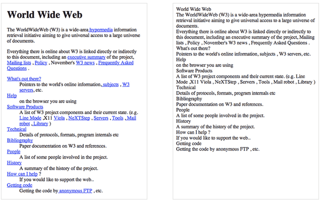
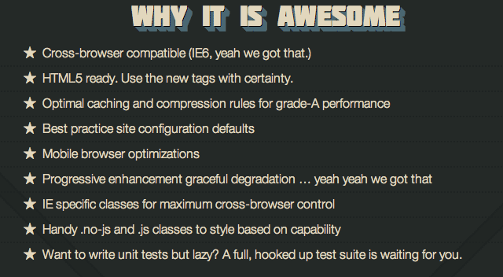

#Specificity, Normalize.css, HTML5 Boilerplate

<!--#Precedence, Normalization, Boilerplate-->

#Specificity

If you have two (or more) conflicting CSS rules that point to the same element, there are some basic rules that a browser follows to determine which one is most **specific** and therefore wins out. Thus, Specificity determines, which CSS rule a browser applies.

##Specificity hierarchy
Every selector has its place in the specificity hierarchy. There are five distinct categories which define the specificity level of a given selector. They are listed here in order of precedence:

1. **!important:** Any property declaration with the term !important takes highest precedence, even over inline styles. If !important is declared more than once on conflicting properties targeting the same element, you CSS author be shot, and the other precedence rules are in effect. It’s as if the weight of the selector with the !important declaration were 1-X-A-B-C, for that property only (where A, B and C are the actual values of the parent selector as described below). Because of this, important should not be used, but can be handy in debugging.

2. **style="":**  Inline styles (Presence of style in HTML document).
An inline style lives within your HTML document. It is attached directly to the element to be styled. E.g. \<h1 style="color: #fff;">. The weight of style="" is 1-0-0-0.

3. **id:** (# of ID selectors)
ID is an identifier for your page elements, such as #div. The weight of an id selector is 1-0-0 per id.

4. **Class, attribute and pseudo-class:** (# of class selectors).
This group includes .classes, [attributes] and pseudo-classes such as :hover, :focus etc, have the same weight of 0-1-0.

5. **type:** Elements and pseudo-elements (# of Element (type) selectors).
Including for instance :before and :after. These have the lowest value in terms of specificity with 0-0-1 per element.

If more than one selector have the same specificity, then adhere to the cascade: the last declared rule takes precedence.

##Exercise

That's a whole lot of talking so let's take a look at something I think can help illuminate things...

[SpeciFISHity](specifishity1.pdf)

##Lab 1
Lab Day is Thursday

##CSS Specificity Tools & Resources

[CSS Specificity for Poker Players](http://iamacamera.org/default.aspx?id=95)

If you’re not from the programming world and CSS seems a bit confusing, perhaps this analogy may help clear some concepts up. Think of CSS rules as poker hands. The best hand determines an element’s style.

[HTMLdog - Specificity](http://www.htmldog.com/guides/css/intermediate/specificity/)

It may not seem like something that important, and in most cases you won’t come across any conflicts at all, but the larger and more complex your CSS files become, or the more CSS files you start to juggle with, the greater likelihood there is of conflicts turning up.

[CSS SpeciFISHity](http://www.standardista.com/css3/css-specificity/)

Some people are confused by CSS Specificity, especially with all of the (not-so) new CSS3 Selectors. Let us have some fish explain this to us.

[Specificity Calculator](http://specificity.keegan.st/)

Visual Calculator

#Normalize.css

In case you didn’t know, every browser has its own default stylesheet, that it uses to make unstyled websites appear more legible. For example, most browsers by default make links blue and visited links purple, give tables a certain amount of border and padding, apply variable font-sizes to H1, H2, H3 etc. and a certain amount of padding to almost everything. Ever wondered why Submit buttons look different in every browser?

####Basic Example: CSS Reset vs. No CSS Reset

Here’s [the first website ever created](http://www.w3.org/History/19921103-hypertext/hypertext/WWW/TheProject.html), with and without a CSS Reset:

For a looooong time one of the best tools for doing this out there on the web was [Eric Meyer's reset.css](http://meyerweb.com/eric/tools/css/reset/). However, like with all thing "web" this has since shifted. Since the advent of HTML5 and CSS3 the current leader in this technique is [Normaliz.css](http://necolas.github.io/normalize.css/) by Nicolas Gallagher. 

What's the difference between normalize.css and reset.css?

1. Normalize.css preserves useful defaults rather than "unstyling" everything. For example, elements like `sup` or `sub` "just work" after including normalize.css (and are actually made more robust) whereas they are visually indistinguishable from normal text after including reset.css. So, normalize.css does not impose a visual starting point (homogeny) upon you. This may not be to everyone's taste. The best thing to do is experiment with both and see which gels with your preferences.

2. Normalize.css corrects some common bugs that are out of scope for reset.css. It has a wider scope than reset.css, and also provides bug fixes for common problems like: display settings for HTML5 elements, the lack of `font` inheritance by form elements, correcting font-size rendering for pre, SVG overflow in IE9, and the `button` styling bug in iOS.

3. Normalize.css doesn't clutter your dev tools. A common irritation when using reset.css is the large inheritance chain that is displayed in browser CSS debugging tools. This is not such an issue with normalize.css because of the targeted stylings.

4. Normalize.css is more modular. The project is broken down into relatively independent sections, making it easy for you to potentially remove sections (like the form normalizations) if you know they will never be needed by your website.

5. Normalize.css has better documentation. The normalize.css code is documented inline as well as more comprehensively in the [GitHub Wiki](https://github.com/necolas/normalize.css/wiki). This means you can find out what each line of code is doing, why it was included, what the differences are between browsers, and more easily run your own tests. The project aims to help educate people on how browsers render elements by default, and make it easier for them to be involved in submitting improvements.

Greater detail about this can be found in the article [about normalize.css](http://nicolasgallagher.com/about-normalize-css/).

##Exercise

Download a copy of the first web page and link normalize.css to it...let's see what happens.

##Lab 2

Lab Day is Thursday

##Resources for Normalize.css:
[The Normalize.css page](http://necolas.github.io/normalize.css/)

The current king of resets...Normailze.css

[Meyerweb.com - Eric Meyer's css reset](http://meyerweb.com/eric/tools/css/reset/)

Take a peek at the former king of css resets

#HTML5 Boilerplate

background:

[HTML5 Boilerplate](http://html5boilerplate.com/) was created by Paul Irish and Divya Manian and is an open source project that is perfect for creating HTML ready cross-browser sites that work with older browsers, including IE.

A tool know as [Modernizr](http://modernizr.com/) is included in order to allow you to style the new HTML5 elements in IE and helps with detecting HTML5 or CSS3 features in all browsers, including earlier versions of IE (before v9).

It I mention it helps with IE?

Why should you care:

Here's some of what it can do:

To be clear, HTML5 Boilerplate is **not a framework**. It's a template that can be modified and used for your own projects. You can use as much or as little as you want and make your own additions and subtractions. Still, it's one of the most robust and well-commented starting points we've seen for setting up a solid HTML5 base for your projects.

##Excercise

Let's take a peek at the code for HTML5 Boilerplate (time allowing)

##Lab 3

Lab Day is Thursday

###Resources:

[Treehouse quick start video (5min)](http://blog.teamtreehouse.com/html5-quick-start-with-boilerplate)

A pretty nifty intro (from 2013)

[2010 mashable article](http://mashable.com/2010/09/01/html5-boilerplate-guide/)

Very old but very good article with many links. Now caution, since this is an older page some of the links do not work but many of the links are still active and contain some useful content.

Compiled and Edited by Alfonso Rush