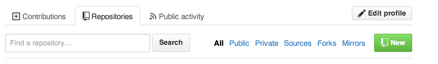
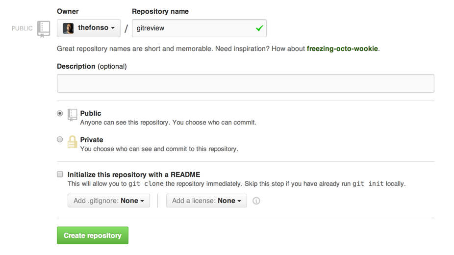

##git-Review

- What is git?
	- a ubiquitous developer tool
	- distributed version control (source code management (SCM)	
- What is github?
	- git is not github
	- github just holds another copy of your repository

- Creating a new project

		- git init
		- git add -A
		- git status
		- git commit -m
		- git push origin master
		

##git-Review (cont.)
- Push changes up to github on your master branch

		- git push origin master
		
		- git log --pretty=format:"%h %s" --graph
		
		- git remote add [NAME] [GITHUB REPO]
	

	
#Exercise

So pair up with your neighbor and help each other along

Go to the github website github.com

###step 1
Create a new local git repo called "gitreview"
	
	mkdir gitreveiw
	
	cd gitreview

###step 2
Now create a new repo on the [github website](github.com). Select the "repositories" link and choose the green "new" button...

Once you have done this you will see a page like the following. Make sure you select everything just as I have here and press..."Create repository"

You should now see the "cheat sheet" on github...

	touch README.md
	git init
	git add README.md
	git commit -m "first commit"
	git remote add origin git@github.com:YOUR_NAME/gitreview.git
	git push -u origin master

###step 3
Now let's create a new file

	touch index.html

Now go and add one paragraph tag inside your index.html file....

Tell me something about you ...Go ahead I'll wait...(3mins)

Now let's add your new file to your repository (first do a git status)

	git status
	
	git add -A
	
	git status
	
Now do a commit to git (here I'm adding a message of my own)

	git commit -m "added index.html file"
	
And finally, push your new git commit up to github.

	git push origin master 

## Homework - Extra Resources

Here are some cool resources. They are grouped by topic, review the material for the areas where you need more clarity or are just curious.

#### Software Development Process
  * [Scrum](http://bit.ly/14qzd)
  * [Agile Dev](http://en.wikipedia.org/wiki/Agile_software_development)

#### Pivotal Tracker
  * [Pivotal Tracker Getting Started Guide](https://www.pivotaltracker.com/help/gettingstarted)
  * [Writing Great User Stories](http://bit.ly/9TOt7X)

#### Sublime
  * [Cool Sublime Text 2 Plugins and Extensions](http://code.tutsplus.com/tutorials/essential-sublime-text-2-plugins-and-extensions--net-24173)
  * [Cool Sublime Text 3 Plugins and configs](http://gis.utah.gov/my-favorite-sublime-text-3-plugins-configs/)

#### Git & GitHub
  * [Git Immersion](http://gitimmersion.com/)
  * [Pro Git](http://git-scm.com/book)

