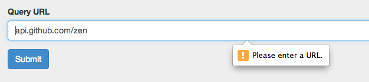
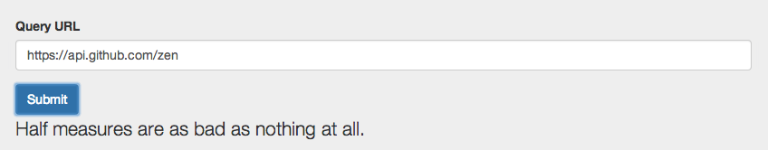
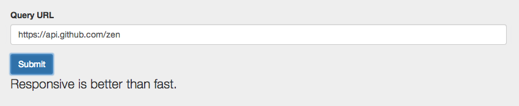

#Angular-Curl
Using Angular, build an app that allows the user to query an API.

The url should be entered in an input field.

On button-click, the returned data from the API should be displayed.

